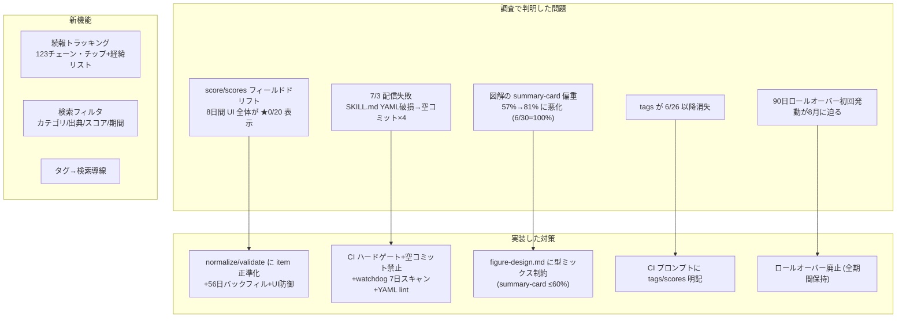

# AI Daily Digest 改善レポート（2026-07-06）

①「より良いツールにするための機能調査＋重要機能の実装」②「UI/UX の総点検・修正」の 2 本立てで実施した調査・実装の全記録。
調査は並列サブエージェント 3 本（フロント機能棚卸し / 7月3日配信失敗の原因究明 / コンテンツ品質の実データ集計）＋ Playwright による全ページ実機検証で行った。

## 全体像

---

## ① 機能調査と実装

### 実装した機能（本コミット群）

| # | 機能 | 実装 | 効果 |
|---|---|---|---|
| 1 | **続報トラッキング**（Phase 3-1） | `scripts/build-followups.mjs` が全日次 JSON を走査し、正規化 URL 一致で「同一記事の複数日登場」を `data/followups.json` に連結（**123 チェーン・291 記事・最長 7 回**）。カードに「続報 n/N」チップ＋展開部に経緯リスト（過去掲載へのディープリンク）。CI の派生物ビルドに組込 | 「この話題、前も見たな」が経緯ごと追える。決定論・LLM 不使用・過去データにも遡及適用 |
| 2 | **検索フィルタ強化**（Phase 2-4） | 検索ページにカテゴリ / 出典タイプ / スコア下限 / 期間の 4 セレクト。`?tag=` `?q=` URL パラメータ対応。search-index に `source_type` 追加 | 1169 件の蓄積からの絞り込みが実用に |
| 3 | **タグ→検索導線** | 日次カードのタグを `search/?tag=` へのリンク化 | タグタップで同トピック横断（Phase 2-4 の導線） |
| 4 | **90日ロールオーバー廃止**（Phase 2-6 の解決） | SKILL.md / publish.md / CI プロンプト / README から archive 移動仕様を削除し「全期間保持」に統一 | 8月に迫っていた初回発動（日付ナビからの過去日消失・検索不整合リスク）を構造ごと解消。index.json は年 70KB 台しか増えない |

### 実装した堅牢化（バグ・事故対応）

| # | 問題（実測） | 対策 |
|---|---|---|
| 5 | **score/scores ドリフト**: 6/18-20・6/28-7/2 の 8 日間、LLM が `scores`（正準・複数形）でなく `score`（単数）で出力。読み手（日次/検索索引/週次）は全員 `scores` を読むため、**該当日は UI 全体でスコアが ★0/20 と誤表示**（週次 W27 #7 で発見） | `normalize-digest.mjs` に item フィールド正準化を追加し **56 日分バックフィル**（単数残存ゼロ・冪等確認済み）。読み手 4 箇所に防御エイリアス。スコア欠落日（6/26 は元データに無し・6/27 は total 欠落）は **0/20 と偽らず非表示**（total を式で補完しないのは、実データの total が加算式と不一致の例が複数あり捏造になり得るため） |
| 6 | **7/3 配信失敗**: 前夜の SKILL.md 編集で YAML frontmatter が破損（クォートなし description 中の「引数:」）→ Claude が起動即エラー→ しかし claude-code-action は `subtype:"success"` のみで判定し**緑のまま**→ 派生物だけの空コミット「? items」が 4 つ | ① Claude 実行直後に**成果物ハードゲート**（当日 JSON 存在＋3 件以上、無ければ run を fail → retry-failed と失敗メールに接続）② commit ステップで**派生物のみコミットを禁止** ③ **watchdog に過去 7 日の欠損再スキャン**（既知 Issue が無い日のみ起票）④ **`lint-skill.yml`**: skills 配下の push 時に frontmatter を検証（実際の 7/3 破損版で NG 検出を確認済み） |
| 7 | **図解の summary-card 偏重**: 57%→直近 1 週 81%、6/30 は 100%。警告 345 件中 223 件が points[].label 欠落 | `figure-design.md` に**型ミックス制約**（summary-card ≤60%・視覚 3 型優先・ただし創作禁止が上位）を明記。CI プロンプトにも要約。validate に日次比率警告を追加 |
| 8 | **tags 消失**: 6/26 以降の全 item から `tags` が消えた（CI プロンプトが生成フィールドを狭く列挙していたのがドリフト原因） | CI プロンプトに tags 必須＋`scores` 複数形固定を明記（summarize-ja.md のスキーマ厳密一致を指示）。validate に tags/scores 欠落警告を追加 |

### 調査で判明したが今回見送った項目（次回スコープ）

- **死亡ソースの置換**: `openai_blog`（11 日失敗）/ `xai_news`・`import_ai`・`chinai`・`mercari`（403 恒常化）/ `reddit_ml`（429）→ sources.md の代替フィード調査が必要（推測でソースを足さない方針のため、次回計測ベースで）
- **弱カテゴリの収集強化**: new_models（充足 0.69）・multimodal（直近 15 日で 0 件が 2 日）
- **7/3 の欠損バックフィル**: 収集プール（data/_collected）がランナーと共に消失済みのため、今から生成すると RSS 残存分からの**部分復元**になる。正確性優先の観点から自動では実施せず、Issue #20 に判断材料を記載
- **`_validation` レポートの全日常態化**（現状 56 日中 6 日分のみ）と grounding_flags の型統一（数値/空配列/文字列配列の 3 型混在）
- Phase 3-5 citation 強化 / 音声ブリーフィング（Phase 4）

## ② UI/UX 総点検の結果

検証マトリクス: 5 ビュー（日次・週次・検索・トレンド・保存）× 2 テーマ × 2 ビューポート（1280 / 390px）＋ 操作系（カード展開・続報リンク遷移・フィルタ・タグ・ディープリンク）。

**発見して修正したもの**
- 週次 Top10 の「★ 0/20」誤表示（→ 上記 #5 の根本修正で解消。週次 #7 は ★15/20 に復旧）
- スコア欠落日の「★ 0/20」誤表示（→ 非表示化。6/26 で確認）
- カテゴリタブ下の横スクロールバーがデスクトップで太いグレー帯に見える（→ `scrollbar-color` で低コントラスト化）
- タグが単なる飾り（→ 検索導線リンク化＋hover 反応）

**問題なしを確認したもの**
- 横オーバーフローなし（全ページ・両ビューポート）/ ダークテーマの面・コントラスト / 図解 4 型の描画（前回修正の回帰なし）/ PWA メタ・オフラインページ / コンソールエラー（SW テスト用 404 と favicon 外部 404 のみ＝想定内）

**既知の残課題（コンテンツ品質・データ側）**
- 7/6 ヘッドラインに「Alibab」の脱字（LLM 生成テキスト。過去分は修正しない方針）
- 旧タグデータに表記ゆれ（例: `Claude Tag`）。生成プロンプトの英小文字ケバブ指定は今後分から効く

## 検証記録

- normalize --all 2 回目 = 変更 0（冪等）/ `score` 単数残存 0 / search-index: score=0 が 0 件・null 50 件（真の欠落のみ）
- followups.json: 123 チェーン / by_item 291 / 実チェーン例: Anthropic S-1（6/02→7/06 で 3 回）、sim-use（7/02→7/06 で 4 回）
- Playwright 実機: 7/6 でチップ 11 件注入・経緯リスト描画・7/2 へのクロス日付遷移＋自動展開＋フラッシュ強調・「続報あり」（初出側）表示
- 検索: `?tag=claude` 22 件・研究論文×★17+×30 日 = 18 件（全件条件充足）・モバイル 2×2 フィルタ折返し
- 編集した 3 ワークフロー YAML は js-yaml でパース検証済み。lint-skill は現行 SKILL.md = OK / 7/3 破損版 = NG を確認
- Service Worker v34（followups.json を network-first に追加）

## 運用への影響

- 毎朝の CI に `build-followups.mjs` が加わる（数秒・依存ゼロ・失敗しても公開は止めない）
- Claude 実行が失敗した日は run が **failure になる**（従来は緑のまま欠損）→ retry-failed が 1 回自動再試行し、それでもダメなら GitHub の失敗メールが届く
- skills 配下を push すると lint-skill.yml が走る（frontmatter 破損を 1 分で検知）
- index.json は今後トリムされない（全期間ナビ可能）
